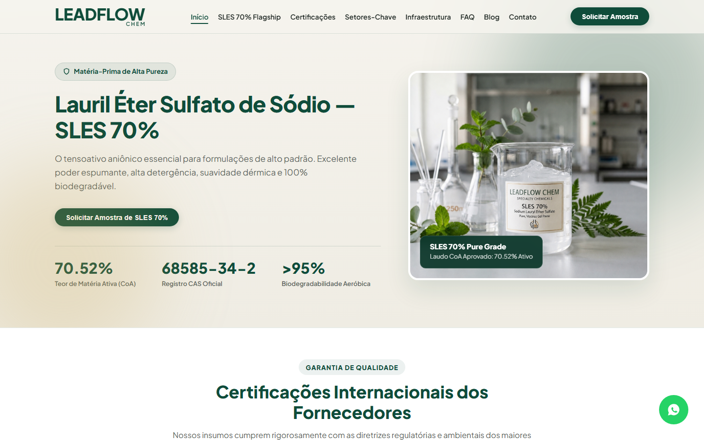
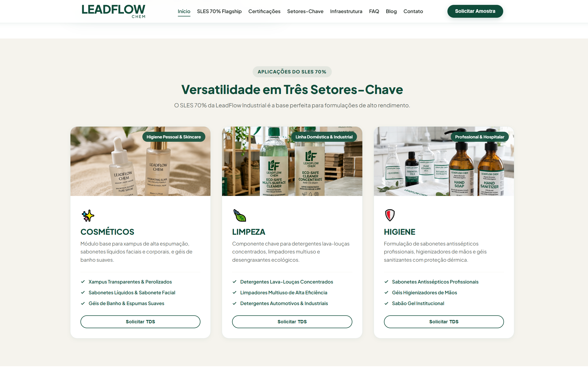
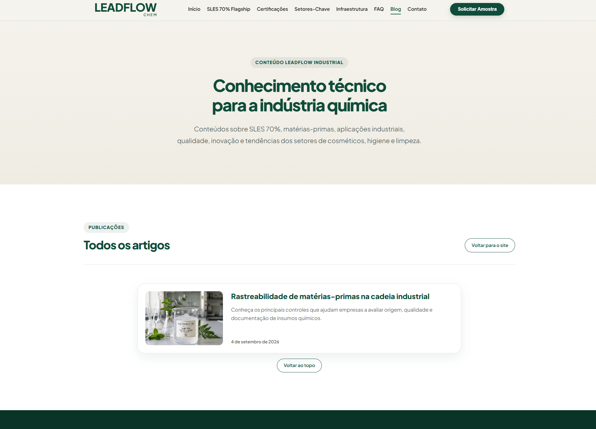
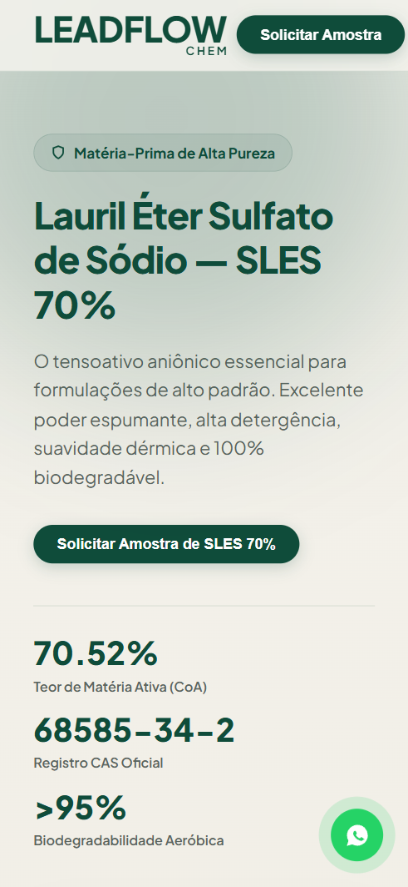

# LeadFlow Portfolio

  Plataforma full stack para captação, processamento e entrega segura de leads.

  
  
  
  
  

## Demonstração visual

### Home — Desktop

  

### Setores-Chave

  

### Blog técnico

  

### Home — Mobile

  

## Sobre o projeto

O **LeadFlow Portfolio** é uma aplicação white label criada para demonstrar uma solução completa de captação e processamento de leads para uma empresa industrial fictícia.

O projeto combina um frontend institucional responsivo com uma API Laravel preparada para validação, persistência, filas, tentativas de entrega, recuperação de falhas e observabilidade.

Esta versão foi preparada exclusivamente para portfólio. Ela não contém identidade, credenciais, dados pessoais ou documentos privados de clientes reais.

## Principais funcionalidades

### Frontend

- landing page institucional responsiva;
- interface multilíngue;
- formulários de contato, solicitação de amostra e WhatsApp;
- integração local com a API Laravel;
- modo público demonstrativo sem transmissão de dados;
- blog local com listagem e página de artigo;
- navegação adaptada para desktop e dispositivos móveis;
- SEO técnico com metadados, Open Graph, dados estruturados e sitemap.

### Backend

- endpoint `POST /api/leads`;
- validação específica para cada tipo de lead;
- normalização e persistência dos dados;
- proteção por honeypot e rate limiting;
- configuração restrita de CORS;
- máquina de estados para acompanhamento do lead;
- processamento assíncrono por fila;
- prevenção de jobs duplicados;
- controle de tentativas e backoff;
- tratamento de falhas temporárias e definitivas;
- recuperação de processamento interrompido;
- correlação por identificador externo;
- logs operacionais sem exposição de dados pessoais;
- comandos administrativos de acompanhamento e reprocessamento;
- driver local para simulação de entrega em CSV.

## Fluxo da aplicação

~~~mermaid
flowchart TD
    A[Formulários do frontend] --> B[POST /api/leads]
    B --> C[Validação e normalização]
    C --> D[(Banco de dados)]
    C --> E[Fila de processamento]
    E --> F[Serviço de entrega]
    F --> G[Driver local CSV]
~~~

## Estados do lead

~~~text
pending
  -> processing
      -> sent
      -> retrying
      -> failed
~~~

O fluxo inclui regras de transição, limite de tentativas, idempotência e recuperação após falhas temporárias.

## Modo de demonstração

A versão pública opera de forma segura:

- os formulários simulam sucesso sem enviar informações para terceiros;
- nenhuma conversa externa de WhatsApp é aberta;
- nenhuma integração comercial é ativada;
- o driver de entrega permanece desabilitado por padrão.

Em `localhost`, o frontend utiliza a API Laravel em:

~~~text
http://127.0.0.1:8000/api/leads
~~~

## Tecnologias

| Camada | Tecnologias |
|---|---|
| Frontend | HTML5, CSS3 e JavaScript |
| Backend | PHP 8.3 e Laravel 13 |
| Banco local | SQLite |
| Produção preparada | MySQL |
| Processamento | Laravel Queue |
| Testes | PHPUnit 12 |
| Qualidade | Laravel Pint |
| Documentação | Markdown |

## Estrutura principal

~~~text
LeadFlowPortfolio/
├── assets/                 # Imagens e recursos visuais
├── backend/                # API Laravel
│   ├── app/                # Domínio, serviços, jobs e contratos
│   ├── config/             # Configurações da aplicação
│   ├── database/           # Migrations e banco local ignorado
│   ├── docs/               # Contrato e operação da API
│   ├── routes/             # Rotas HTTP
│   └── tests/              # Testes unitários e de integração
├── blog/                   # Página do blog
├── css/                    # Estilos da interface
├── docs/                   # Documentação técnica
├── js/                     # Interface, traduções e blog local
├── index.html              # Página inicial
├── robots.txt
└── sitemap.xml
~~~

## Execução local

### Requisitos

- PHP 8.3 ou superior;
- Composer;
- extensão SQLite habilitada;
- navegador moderno;
- Live Server ou outro servidor estático para o frontend.

### Backend

~~~bash
cd backend
composer install
~~~

Crie o arquivo de ambiente:

~~~bash
cp .env.example .env
php artisan key:generate
~~~

Crie o banco SQLite e execute as migrations:

~~~bash
php -r "file_exists('database/database.sqlite') || touch('database/database.sqlite');"
php artisan migrate
~~~

Inicie a API:

~~~bash
php artisan serve
~~~

### Frontend

Abra a raiz do projeto com o Live Server. Durante o desenvolvimento local, mantenha a API disponível em `http://127.0.0.1:8000`.

## Pacote de publicação

O script `build-dist.ps1` gera a pasta `dist` somente com os arquivos públicos do frontend:

~~~powershell
.\build-dist.ps1
~~~

A pasta gerada é ignorada pelo Git e pode ser recriada a qualquer momento.

## Testes e qualidade

Execute a suíte completa:

~~~bash
cd backend
php artisan test
~~~

Resultado da validação atual:

~~~text
87 testes aprovados
426 asserções aprovadas
0 falhas
~~~

Valide o padrão de código:

~~~bash
php vendor/bin/pint --test
~~~

Todos os 73 arquivos PHP analisados foram aprovados pelo Laravel Pint.

## Segurança e privacidade

- nenhuma credencial real é versionada;
- arquivos `.env` são ignorados pelo Git;
- o banco SQLite local não é versionado;
- logs não registram o payload completo nem dados pessoais;
- entregas externas permanecem desabilitadas;
- dados utilizados nos testes são exclusivamente fictícios;
- imagens e identidade visual pertencem à versão demonstrativa.

## Integrações futuras

A arquitetura mantém pontos de extensão preparados para futuras integrações externas, sem ativá-las na versão pública:

- 3C / 3C Plus para automação e entrega operacional de leads;
- Kommo como CRM para acompanhamento comercial e sincronização do ciclo do lead.

As credenciais, os contratos e os drivers definitivos serão implementados somente após homologação nos ambientes correspondentes.

## Status

A versão demonstrativa está funcional e validada localmente. O frontend, a API, o banco de dados, os testes, o blog e o fluxo local de entrega em CSV estão implementados.

Integrações externas reais não fazem parte desta versão pública.

## Autor

**Diogo Antonio Zarpelão**

Desenvolvimento full stack, arquitetura da aplicação, testes automatizados, documentação técnica e preparação da versão white label para portfólio.

## Uso

Este repositório é apresentado para fins de estudo, demonstração técnica e portfólio profissional. Todos os direitos reservados.
